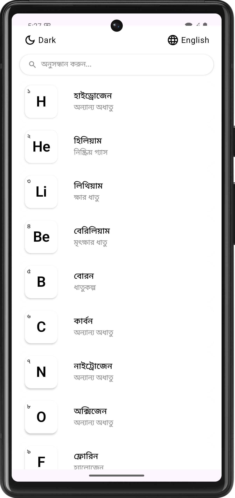
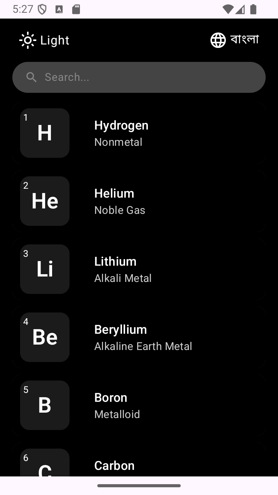

# 📱 Periodic Table

An Android app built with **Jetpack Compose** that features a list of **118 elements**, each with detailed information. Supports **light/dark themes** and **Bangla/English** language selection. 🚀

---

## ✨ Features

- 📜 **118 Elements List** – Click on any element to view its details.
- 🎨 **Themes** – Light and Dark themes.
- 🌍 **Multi-language Support** – Choose between **Bangla** and **English**.
- 🔍 **Search Functionality** – Works seamlessly for both **Bangla** and **English**.
- ⚡ **Jetpack Compose UI** – Fully modern, reactive, and smooth UI experience.
- 🔥 **State Management** – Efficient handling of UI state.
- 🛠 **MVVM Architecture** – Clean and scalable codebase.

---


## 📸 Screenshots

| Light Mode | Dark Mode |
|------------|-----------|
|  |  |


---

## 🚀 Getting Started

### Clone the Repository
```sh
git clone https://github.com/asiradnan/Periodic-Table.git
```

### Build & Run
1. Open the project in **Android Studio**.
2. Sync dependencies and build the project.
3. Run on an emulator or physical device.

---

## 🛠 Technologies Used
- **Jetpack Compose** – UI Toolkit
- **Kotlin** – Primary Language
- **Material 3** – Theming & Components
- **Local Storage** – SharedPreferences for language settings

---

## 📌 Roadmap
- [ ] Improve animations 🌀
- [ ] Add more languages 🌎
- [ ] Add filtering options 🔽

---

## 🤝 Contributing
Pull requests are welcome! If you find a bug or have a feature request, feel free to open an issue. 🙌

---

## 📄 License
This project is **open-source** and available under the **MIT License**.

---

## 💬 Connect With Me
- 💼 [Asir Adnan](https://asiradnan.com)
- 🔗 [LinkedIn](https://linkedin.com/in/asiradnan)
- 📧 Email: hello@asiradnan.com

---

Give this repo a ⭐ if you found it useful! 😃
