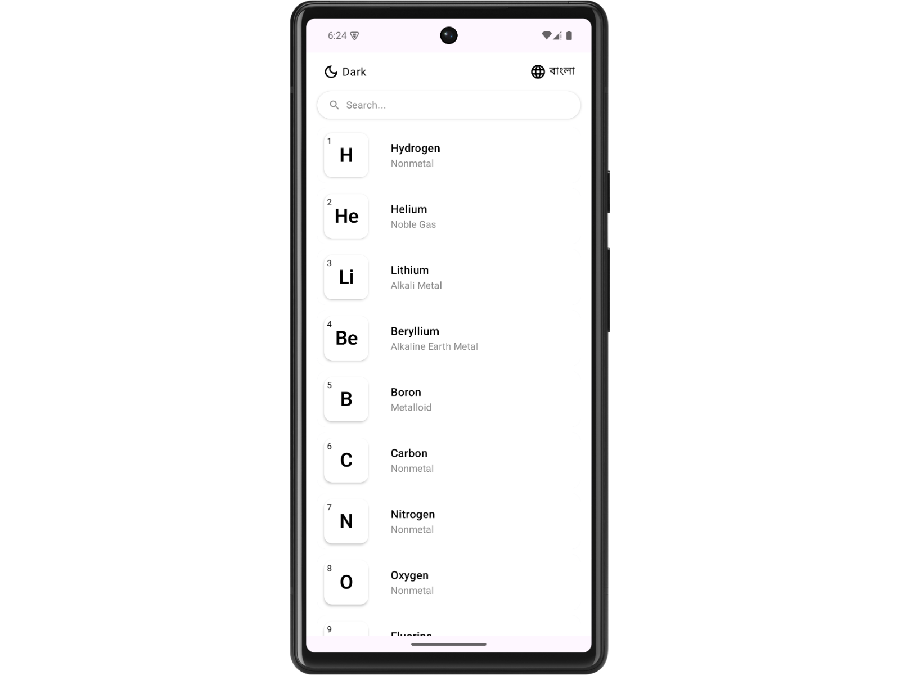

<p align="center"><h1 align="center">PERIODIC TABLE</h1></p>
<h3 align="center">
Check out: <a href="https://play.google.com/store/apps/details?id=com.asiradnan.periodictable&pli=1/">Live on Play Store</a>
</h3>
<p align="center">Built with the tools and technologies:</p>
<p align="center">
    
    
    
</p>
<br>
<p align="center">
  
</p>

## Table of Contents
- [Table of Contents](#table-of-contents)
- [Overview](#overview)
- [Tech](#tech)
- [Features](#features)
- [Project Structure](#project-structure)
- [Getting Started](#getting-started)
  - [Prerequisites](#prerequisites)
  - [Installation](#installation)
- [License](#license)

## Overview
An Android application built with Kotlin that provides a visual periodic table for chemistry reference. Explore detailed information about each chemical element with an interactive UI.

---

## Tech
- **Language:** Kotlin  
- **Platform:** Android (SDK + Gradle)  
- **Build Tool:** Gradle (Kotlin DSL)  
- **UI:** Android Views or Jetpack Compose (based on repo content)


## Features
- **Interactive Periodic Table:** Browse and tap on elements to view detailed data.
- **Element Details:** Displays atomic number, symbol, weight, group, period, etc.
- **Search Functionality:** Quickly find elements by name.
- **Clean UI:** Optimized for mobile devices with intuitive navigation.
- **Language Support:** All functionalities available for both English and Bangla
## Project Structure

```text
Periodic‑Table/
├── app/
│   ├── src/
│   │   ├── main/
│   │   │   ├── AndroidManifest.xml
│   │   │   ├── java/... (Kotlin source files)
│   │   │   └── res/
│   │   │       ├── layout/
│   │   │       ├── values/
│   │   │       └── drawable/
│   └── build.gradle.kts
├── build.gradle.kts
├── gradle/
├── gradle.properties
├── gradlew
├── gradlew.bat
└── settings.gradle.kts
```

## Getting Started
### Prerequisites
- Android Studio (Arctic Fox or later recommended)
- Android SDK installed via Android Studio
- Kotlin plugin (bundled with AS)

###  Installation
1. Clone the repository:
   
```sh
git clone https://github.com/asiradnan/Periodic-Table.git
```

2. Navigate to the project directory:
```sh
cd Periodic-Table
```

3. Open in Android Studio → Let it import and download Gradle dependencies.

4. Build and run the app on an Android device or emulator.


##  License

This project is protected under the [MIT](https://choosealicense.com/licenses/mit/) License. For more details, refer to the [LICENSE](https://github.com/asiradnan/Periodic-Table/blob/main/LICENSE) file.

---