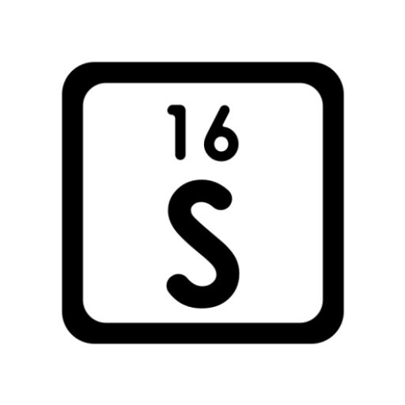
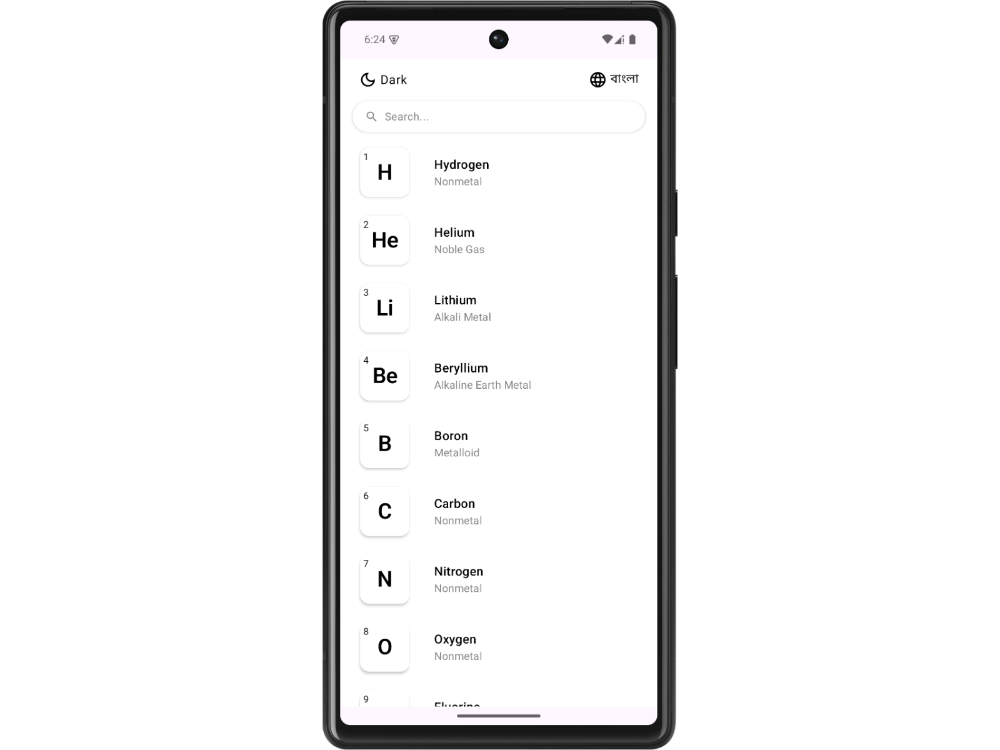
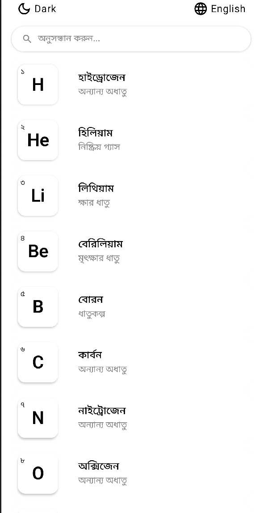
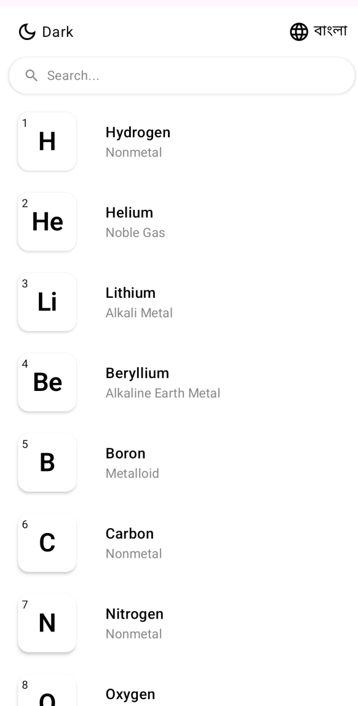
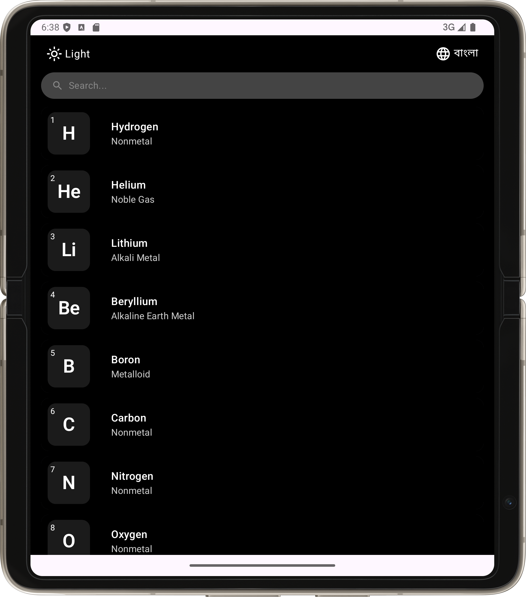

#  Periodic Table

  

##  Live Link

Check out Periodic Table in action: [Live on Play Store](https://play.google.com/store/apps/details?id=com.asiradnan.periodictable)

## Overview

An Android app built with Kotlin and Jetpack Compose that provides a visual periodic table for chemistry reference, with detailed information about each chemical element.

## Screenshots

  

## Features

- **Interactive Periodic Table:** Browse and tap on elements to view detailed data.
- **Element Details:** Displays atomic number, symbol, weight, group, period, and more.
- **Search Functionality:** Quickly find elements by name.
- **Language Support:** Fully available in both English and Bangla.
- **Dark Mode:** Supports light and dark themes.

## Tech Stack

- **Language:** Kotlin
- **UI Toolkit:** Jetpack Compose
- **Min SDK:** 29 · **Target SDK:** 35
- **Build Tool:** Gradle (Kotlin DSL)

## License

This project is open source under the **MIT License**.